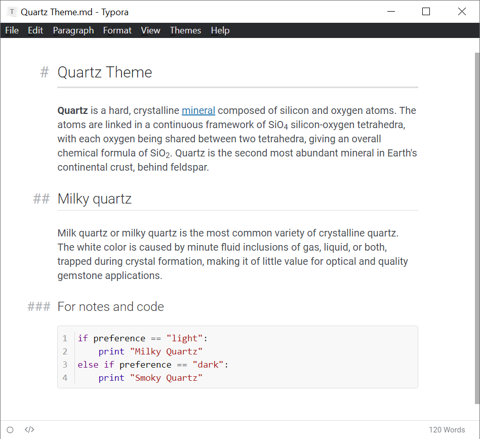
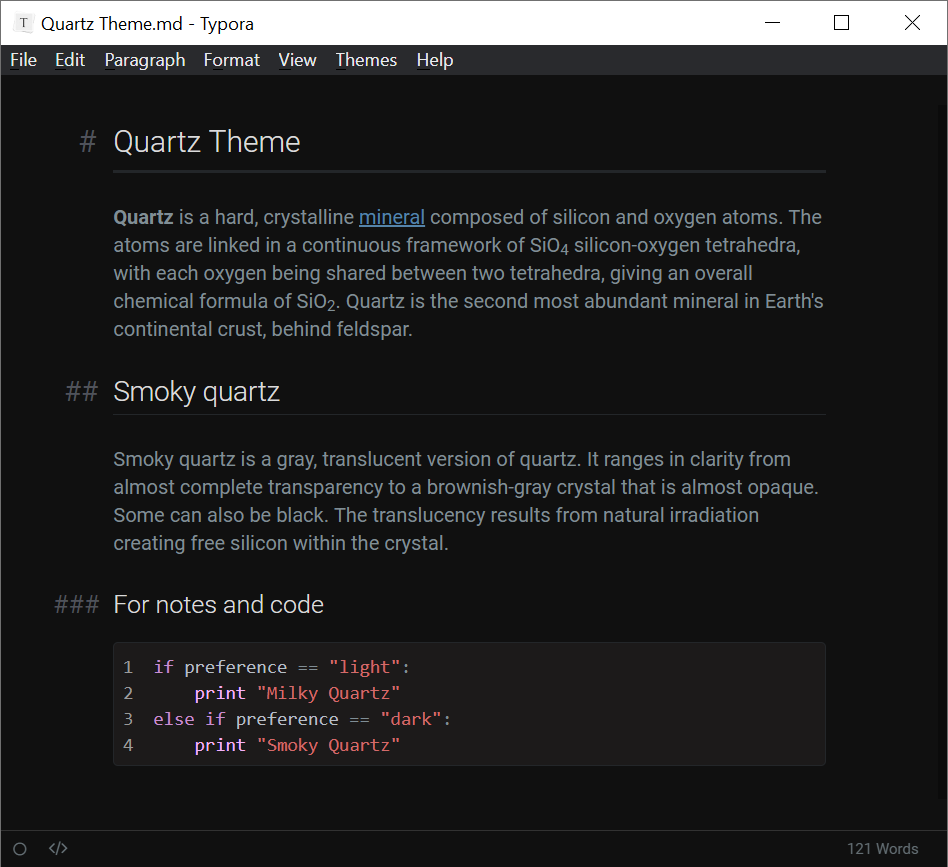
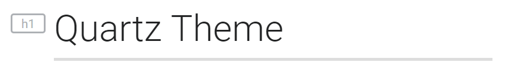

# Quartz Theme for Typora

This is a fork of the [Quartz](https://github.com/troennes/quartz-theme-typora) theme written by [troennes](https://github.com/troennes) for typoria. Modified based on personal preferences.

  

Differences from orginial theme:
- Changed the header tag icon when the window is less than 640px wide  
    
  
- Added underlines under level 1 and 2 headers
- The newline indicator is a ` ` instead of the default down arrow  
    
  
- Disabled the light cursor for darkmode (if you need a light cursor uncomment
  the comment in `quartz-smoky.css`)
- Monospace font is Consolas rather than Inconsolata.

Tested on Windows.